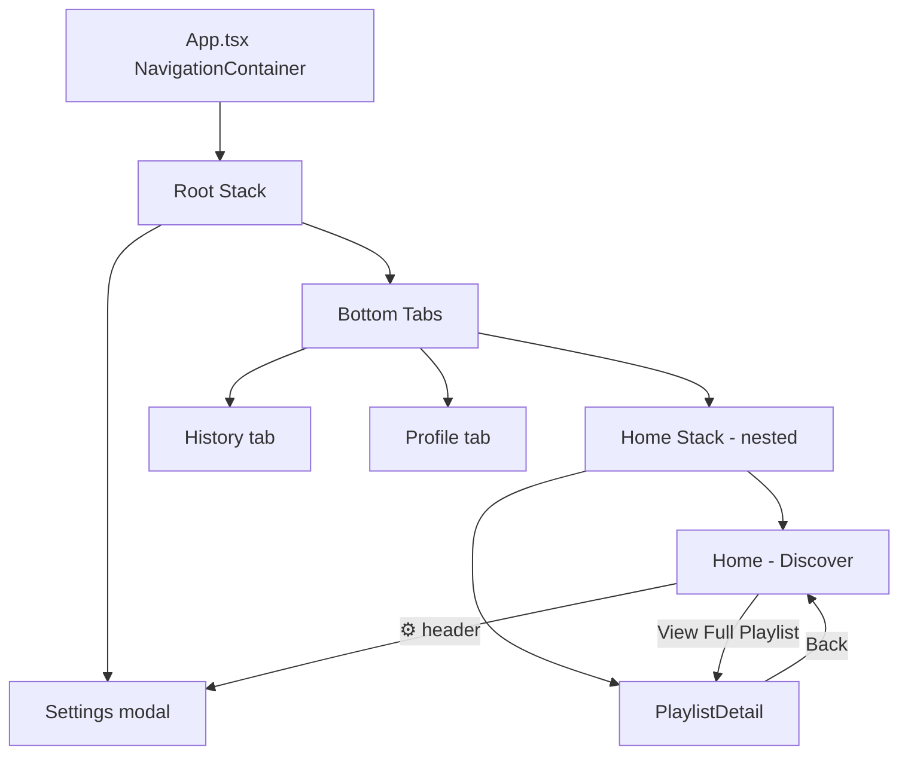

# SpotifyMood

## What is this?

SpotifyMood helps you discover music that matches how you feel in the moment. On the Discover tab you scan your mood with the front camera, and the app suggests a curated playlist aligned with that emotion (Happy, Sad, Angry, Chill, or Hype). When you connect Spotify, recommendations and track lists come from the real Spotify API; otherwise the app still works with built-in fallback playlists. Every scan is saved to a personal history you can browse, pull to refresh, and paginate by date. Profile and Settings let you customize your display name, bio, favourite genre, haptic feedback, and Spotify connection — all persisted on-device so your preferences survive restarts.

## How it's built

SpotifyMood is a React Native app on **Expo SDK 54** (New Architecture) written in **TypeScript** with strict checking. Navigation uses React Navigation 7 in three layers: a root `NativeStackNavigator` (tabs + Settings modal), a `BottomTabNavigator` (Discover, History, Profile), and a nested stack inside Discover (Home → Playlist Detail). Feature code lives under `src/features/` with public barrels (modlets); cross-cutting types and navigation param lists are exposed only via `#shared`. Persistence uses **AsyncStorage** through `useStorage` — never imported in screens. Device features are abstracted in hooks: **expo-camera** via `useMoodCamera`, **expo-haptics** via `useHaptics`. Styling is centralized in `design-system/` (tokens + primitives + reusable components); screens keep minimal layout styles. Tests use **Jest 29**, **jest-expo**, and **React Native Testing Library**. CI runs typecheck, ESLint, Prettier, Knip, and tests as separate steps; **EAS Build** runs on pushes to `main`.

**Key tech stack:**

- Expo SDK 54 / React Native 0.81 / React 19
- TypeScript 5.9 (strict)
- React Navigation 7 (native-stack + bottom-tabs)
- AsyncStorage — mood history, profile, settings, Spotify tokens
- expo-camera — mood scan capture
- expo-haptics — mood-specific feedback patterns
- Spotify Web API + OAuth PKCE (expo-auth-session) — optional live recommendations
- Jest 29 + React Native Testing Library
- ESLint + Prettier + Knip
- GitHub Actions + EAS Build

## Getting started

### Prerequisites

- **Node.js** ≥ 20
- **npm** ≥ 10
- **Expo Go** on a device, or Android Emulator / iOS Simulator
- _(Optional)_ [Spotify Developer](https://developer.spotify.com/dashboard) app for live tracks
- _(For CI builds)_ [Expo account](https://expo.dev) and `eas-cli` (`npm i -g eas-cli`)

### Environment variables

Copy `.env.example` to `.env` and fill in values as needed:

| Variable                        | Required                      | Purpose                                   |
| ------------------------------- | ----------------------------- | ----------------------------------------- |
| `EXPO_PUBLIC_SPOTIFY_CLIENT_ID` | No (local demo works without) | Spotify OAuth + API recommendations       |
| `EXPO_TOKEN`                    | CI only (GitHub secret)       | Authenticates EAS Build in GitHub Actions |

**Spotify setup (optional):**

1. Create an app at https://developer.spotify.com/dashboard
2. Add redirect URIs: `skycast://spotify-auth` and your Expo Go URL (e.g. `exp://192.168.x.x:8081`)
3. Paste the Client ID into `.env` as `EXPO_PUBLIC_SPOTIFY_CLIENT_ID`

PKCE is used — no client secret is required on mobile.

### Local development

```bash
npm install
npm start          # Expo Dev Tools — scan QR with Expo Go
npm run android    # Android emulator/device
npm run ios        # iOS simulator
```

### Running checks

```bash
npm run lint-typecheck   # TypeScript only
npm run lint-eslint      # ESLint only
npm run lint-prettier    # Prettier only
npm run lint-knip        # Dead-code check
npm run lint             # All of the above
npm test                 # Jest (smoke, unit, integration tests)
```

### EAS cloud builds

```bash
eas init
eas build --profile preview --platform all
```

Preview builds also run automatically on push to `main` when `EXPO_TOKEN` is configured in GitHub Secrets.

## Navigation (start here for routing review)

All routing is defined under **`src/navigation/`** — not in feature folders. Read in this order:

1. **`src/navigation/navigationMap.ts`** — tree diagram and every user transition (from → trigger → to)
2. **`src/navigation/routes.ts`** — `ROUTES` constants (no magic strings in screens)
3. **`src/navigation/hooks.ts`** — `useRootNavigation`, `useHomeStackNavigation`, `navigateTo*` helpers
4. **`src/shared/navigationTypes.ts`** — TypeScript params for each screen



| Level      | Navigator    | File                     | Screens                              |
| ---------- | ------------ | ------------------------ | ------------------------------------ |
| 1 — Root   | Native Stack | `RootNavigator.tsx`      | `Tabs` (initial), `Settings` (modal) |
| 2 — Tabs   | Bottom Tabs  | `MainTabNavigator.tsx`   | `HomeTab`, `History`, `Profile`      |
| 3 — Nested | Native Stack | `HomeStackNavigator.tsx` | `Home`, `PlaylistDetail`             |

**Where navigation is triggered**

| From            | Action             | API                                       |
| --------------- | ------------------ | ----------------------------------------- |
| Discover header | ⚙️                 | `navigateToSettings(useRootNavigation())` |
| Discover        | View Full Playlist | `navigateToPlaylistDetail(...)`           |
| Playlist Detail | ← Back             | `navigation.goBack()`                     |
| Tab bar         | Switch tab         | Built-in tab navigator                    |

## Project structure

```
src/
  index.ts                 # entry (main in package.json)
  App.tsx                  # NavigationContainer only — minimal shell
  shared/                  # public API (#shared alias) + navigationTypes
  navigation/              # ALL navigators, ROUTES, navigationMap, hooks
  design-system/           # tokens, primitives, reusable UI
  features/                # screens only (no navigators)
  hooks/                   # persistence, haptics, camera abstraction
```

Import rules:

- Cross-feature types/navigation: `import { … } from "#shared"`
- Feature internals: import from that feature's `index.ts` barrel
- Design system: `import { Button, colors } from "../design-system"` (or feature-relative path)
- Never import from another feature's subfolders directly

## Course requirements checklist

| Requirement                         | Where                                                                                    |
| ----------------------------------- | ---------------------------------------------------------------------------------------- |
| Multiple components + hooks         | Design system + feature screens; `useState`, `useEffect`, `useCallback`, `useMemo`, etc. |
| StyleSheet in every component       | All `.tsx` UI files including navigators and Typography                                  |
| Root Stack + Tabs + nested Stack    | `navigation/` — see **Navigation** section above                                         |
| Feature-based + modlets             | `src/features/*/index.ts` barrels                                                        |
| `#shared` alias                     | `tsconfig.json` paths; Jest `moduleNameMapper`                                           |
| Primitives separate from components | `design-system/primitives/`                                                              |
| Reusability documented              | Comments on Button (HIGH) vs ScreenLayout (LOW), etc.                                    |
| Persistence in hooks                | `useStorage`, `useMoodHistory`, `useProfile`, `useSettings`                              |
| Device features abstracted          | `useMoodCamera`, `useHaptics`                                                            |
| TextInput + Switch + storage        | Profile (`FormField`), Settings/Profile (`SettingsRow`)                                  |
| Logic vs rendering                  | `useHomeMood`, `groupMoodHistoryByDate`, `playlistTracks`, `useProfile` validation       |
| Tests                               | `design-system/components/__tests__/` — smoke, unit (mock + press), integration          |
| CI/CD                               | `.github/workflows/ci.yml` — lint steps + tests + EAS on main                            |
| SectionList + FlatList              | `HistoryScreen` (pull-to-refresh, `onEndReached`); `PlaylistDetailScreen`                |
